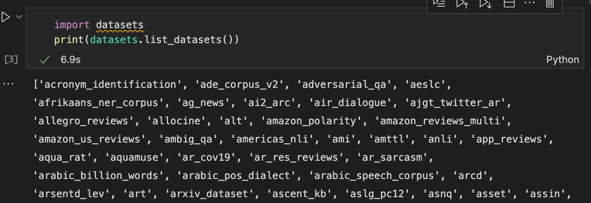
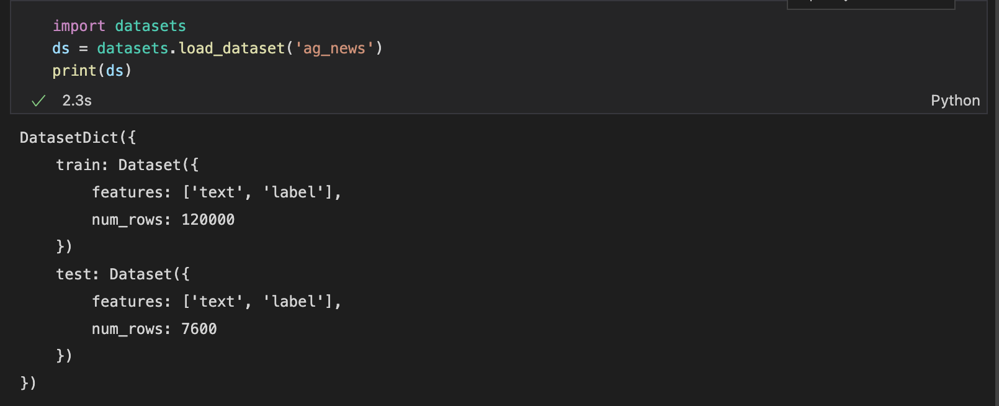
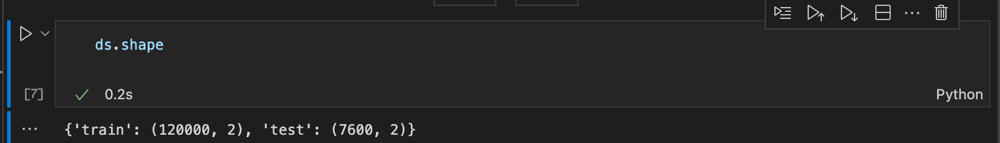
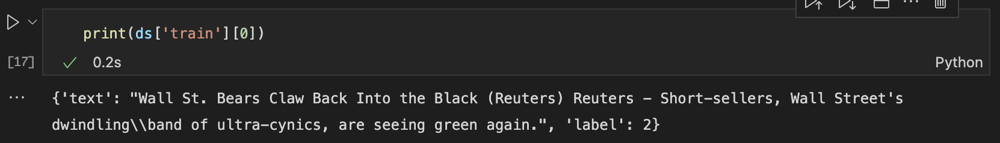
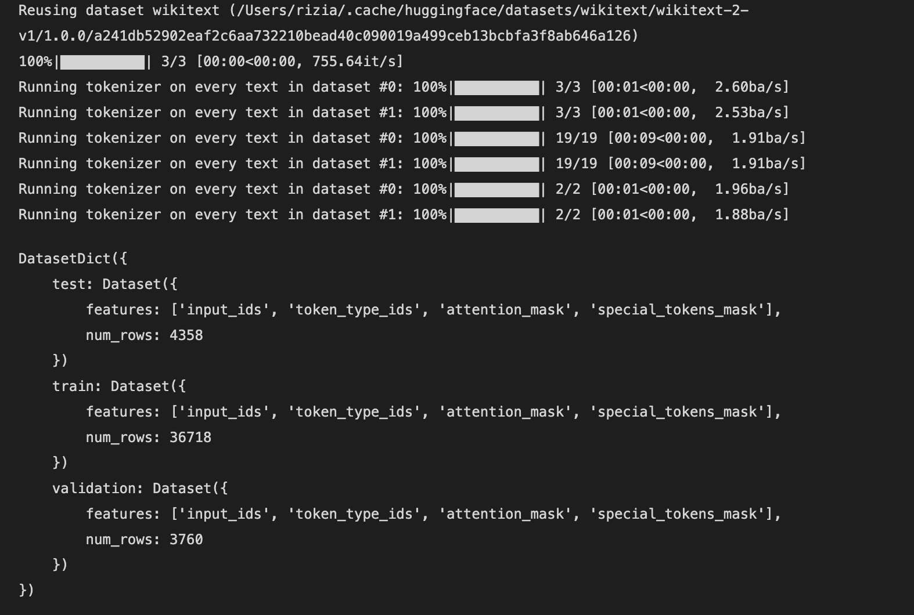

在机器学习中一些常用的datasets库的设计及使用

<!--more-->

在机器学习的使用中，我们常用的有很多库来辅助数据的处理、数据集的管理等等，比如说pandas、tensorflow等等，因为最近在做NLP相关的，所以着重了解一下HuggingFace的Dataset。

[Github](https://github.com/huggingface/datasets#main-differences-between-🤗Datasets-and-tfds)

[Doc](https://huggingface.co/docs/datasets/index)

HuggingFace的datasets的底层依赖于Apache Arrow，而tf依赖于tf.record，这两种都可以处理大量的数据，利用内存映射从磁盘上读取数据。


### 如何使用

咱们先来看看hf-datasets一般是如何使用的：

```
# 利用list_datasets()函数，我们能看到所有huggingface支持的数据集，同时也可以在网站上找到， https://huggingface.co/datasets
import datasets
print(datasets.list_datasets())
```



我们从里面选一个数据集出来看看里面是如何存储的，这里拿ag_news试试

通过load_dataset，传入数据集的名字就可以快速读取数据集，同时包括训练集和测试集。



dataset有各种属性，我们可以从这个结构里面获取任何我们想要的信息



也可以看到里面的原始数据长什么样



### 数据处理

比如说我现在需要训练一个Bert，怎么把这个datasets用起来呢。

```
from datasets import load_dataset
from transformers import AutoTokenizer
raw_ds = load_dataset('wikitext', 'wikitext-2-v1')

tokenizer = AutoTokenizer.from_pretrained('bert-base-uncased')

def tokenize_function(examples):
    return tokenizer(examples['text'], truncation=True, padding="max_length", max_length=512, return_special_tokens_mask=True)

# 原始代码提供map函数，可以直接对里面的每一个元素过一个函数，利用这个方法可以多线程处理数据
tokenized_datasets = raw_ds.map(
    tokenize_function,
    batched=True,
    num_proc=2,
    remove_columns=raw_ds['train'].column_names,
    desc="Running tokenizer on every text in dataset",
)

print(tokenized_datasets)
```

运行上面的代码可以得到结果



可以看到直接生成了最后的samples，使用起来很方便

### 源码解析

留坑待填


